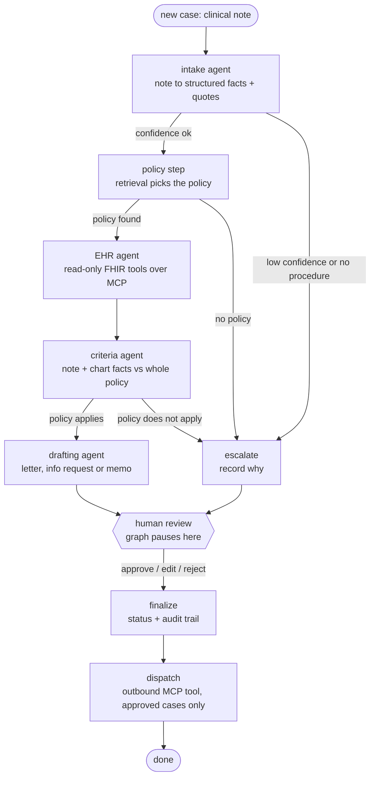

# Architecture (Week 6)

## Workflow

There is no edge from an agent to `finalize` or `dispatch`. Every case, including escalations, stops at
`human_review`, which uses LangGraph's `interrupt()` and resumes only when a reviewer submits a decision. The `ehr`
and `dispatch` steps exist only when their MCP servers are configured; without them the workflow is the Week 3
note-only workflow.

## What is code and what is the model

| Step | Who decides | Why |
|---|---|---|
| Reading the note, matching it to criteria, writing drafts | Claude | Language understanding is what it is good at |
| Which chart tools to call | Claude (from a fixed allow-list) | Choosing what to look up depends on the policy and the gaps |
| The text of every chart fact | Plain code | Facts are built from FHIR resources by code, so the model cannot invent or reword them |
| Routing (escalate or continue) | Plain code | Safety-critical, so it must be deterministic, testable and explainable |
| Recommendation (`likely_meets`, `needs_more_info`, `likely_not_meets`) | `criteria.decide()`, plain code | The model reports findings; it never decides coverage |
| Approve, edit or reject | A human reviewer | Assistive system by design |
| Whether anything is sent out, and where | `dispatch.plan()`, plain code | Only after approval, by document type, with the approver's name |

## Guardrails between the model and the decision

| Guardrail | Where | What it prevents |
|---|---|---|
| Every quote is checked against the note or one chart fact, never text stitched from two places | intake, criteria | Fabricated evidence |
| A requirement marked `met` needs a verified quote (code checks for CPT/ICD codes are done by code) | `criteria.validate` | Unsupported approvals |
| A `not_met` needs a verified quote; silence in the note means `unclear` | `criteria.validate` | Missing documentation being treated as failure |
| `likely_not_meets` needs affirmative evidence against the request; an exclusion alone is not enough | `criteria.decide` | The model turning "exam limited" into grounds for denial |
| Citations must point to a policy section that was actually supplied | `criteria.validate` | Invented policy references |
| Drafting agent sees only verified structured facts, never the raw note | `drafter.draft` | Unverified text leaking into letters |
| Codes in a draft must exist in the source data | `drafter.check_codes` | Invented CPT or ICD codes |
| Low confidence, no policy, or a policy that does not cover the procedure skips the agents and goes to a human | `escalation_reason` | Confident nonsense on out-of-scope cases |
| Approve is refused when there is no draft; a finished case cannot be reviewed twice | `validate_review`, API 409 | Rubber-stamping and double submission |
| The chart lookup uses read-only tools from a fixed allow-list, with the patient identifier forced to the one on the request, a 3-round limit and a fact cap | `agents/ehr.py` | An agent (or an instruction hidden in chart text) reading another patient's record or running away |
| Any chart-lookup failure degrades to a note-only assessment | `agents/ehr.py`, graph | A broken integration blocking review |
| Outbound tools are write-side only, need the approver's name, validate input and are idempotent per case | `outbound_server.py` | Sending unapproved or duplicate documents |
| A failed send is recorded but never undoes the reviewer's decision | `dispatch_node` | Losing a decision because a portal was down |

## Why retrieval only picks the policy

The Week 2 eval showed section-level retrieval mixes up neighbouring sections inside the right policy. So the
policy step uses retrieval to choose which policy applies, then hands the **entire** policy (plus the general
requirements that a clinical note can satisfy) to the criteria agent. Section-level retrieval errors never
reach the decision. The default retrieval mode is `hybrid_w3_rerank` (see `retrieval-experiments.md`).

## MCP integrations (Week 4)

Two MCP servers, kept apart because they have different trust levels. See `integrations.md` for the tool
lists, the transport, and how to inspect them.

| Server | Tools | Direction | Used by |
|---|---|---|---|
| `northbridge-fhir` | `get_patient`, `get_conditions`, `get_medications`, `get_procedures`, `get_exam_findings`, `get_imaging_reports`, `get_service_requests` | Read only | The EHR agent, before assessment |
| `northbridge-outbound` | `submit_prior_authorization`, `send_clinician_message` | Write | The `dispatch` step, after a human approves |

| Approved document | Outbound action |
|---|---|
| Submission letter | Submit to the payer (a FHIR `Claim` with `use = preauthorization`) |
| Information request | Message the ordering clinician |
| Denial-risk memo | Nothing leaves the system |

## Persistence and audit

- Checkpointer: in-memory by default; `CHECKPOINTER=postgres` stores paused cases in Postgres so they survive
  an API restart.
- `cases` holds one row per case (status, recommendation, full state without policy text, including the chart
  facts that were used and what was sent out).
- `case_events` holds one row per workflow step with latency and token counts (the `ehr` and `dispatch` steps
  included). This is what the Week 5 dashboard reads.

## API

| Method and path | Purpose |
|---|---|
| `POST /cases` | Start a case. Returns `202` with the case id at once; the workflow runs in the background. `?wait=true` blocks and returns the finished packet (used by scripts) |
| `GET /cases/{id}` | Current status, review packet (chart facts, source of each quote), dispatch result, trace. Live cases come from the checkpointer; after an API restart the saved copy is returned read-only (`resumable: false`) |
| `POST /cases/{id}/review` | Reviewer approves, edits or rejects (the only way to finalize, and the only trigger for sending). `409` if already decided, `422` if a submission or request still has `[placeholders]` (the case stays open) |
| `GET /cases` | Review queue: running and failed cases first, then saved cases |
| `GET /metrics?days=` | Numbers for the dashboard, computed by a pure function over saved cases and their step events |
| `GET /samples` | The synthetic sample notes, so the UI can start a case in one click |
| `GET /policy/search` | Policy retrieval with citations |
| `GET /health` | Liveness (no key needed) |

`API_KEY` in `.env` turns on a shared-secret check (`X-API-Key`) on everything except `/health`. Empty means open,
which is fine on localhost only.

## Reviewer UI and dashboard (Week 5)

`frontend/` is a Next.js (App Router, TypeScript, Tailwind) app using React Query for polling.

- **The browser never talks to the API directly.** `src/app/api/[...path]/route.ts` is a server-side proxy with an
  allow-list of routes. It adds `X-API-Key` and hides the backend address, so the secret stays on the server and the
  API can stay on a private network.
- **Queue** polls every 3 s while a case is running (10 s otherwise). **Case page** polls every 2 s while the workflow
  runs, then shows the packet: recommendation, each requirement with its quote and where it came from (note or chart),
  guardrail notes, the clinical note with quotes highlighted, and the step trace.
- **Decision panel.** The draft is editable. Unchanged means Approve; changed means "Approve with edits". A draft with
  placeholders disables Approve and says why; the API enforces the same rule. Reject needs a confirm.
- **Dashboard.** Outcomes, what reviewers did with each recommendation (an edit or reject is the human overruling the
  machine, so a high rate on one recommendation shows where to improve), p50/p95 latency per step, which guardrails
  fired, chart lookup and dispatch health with reasons for blocked sends, cases per day. Every chart has a table view.
- Charts are plain HTML/CSS rather than a chart library, so marks stay thin, data ends are rounded, status always has
  an icon and a label, and the palette is one validated set with light and dark variants.

Try the UI without Claude or a database: `python scripts/demo_api.py` runs the real API on a scripted fake model with
synthetic dashboard data (clearly labelled as demo).

## Speed and per-step models (Week 6)

`Deps` carries a model per step (`step_models`) and two switches for the criteria step (`assess_lean`, `assess_split`).
The lean and split forms are different tool schemas that `expand_lean` turns back into the same `CriteriaAssessment`
before validation, so guardrails and `decide()` are identical in every mode; a test asserts the three modes produce
the same assessment from equivalent model output. Each LLM step's trace event records the model it ran on. Details,
the dependency analysis of why steps cannot simply run in parallel, and how to measure: [latency-and-models.md](latency-and-models.md).

## Deployment (Week 6)

Containers and Kubernetes manifests are described in [deployment.md](deployment.md). The API reports `/health`
(process up) and `/ready` (database reachable and, with `WARMUP_ON_START`, the retrieval models loaded), and runs one
replica because a started case runs in that pod's background thread. Operations: [runbook.md](runbook.md).
