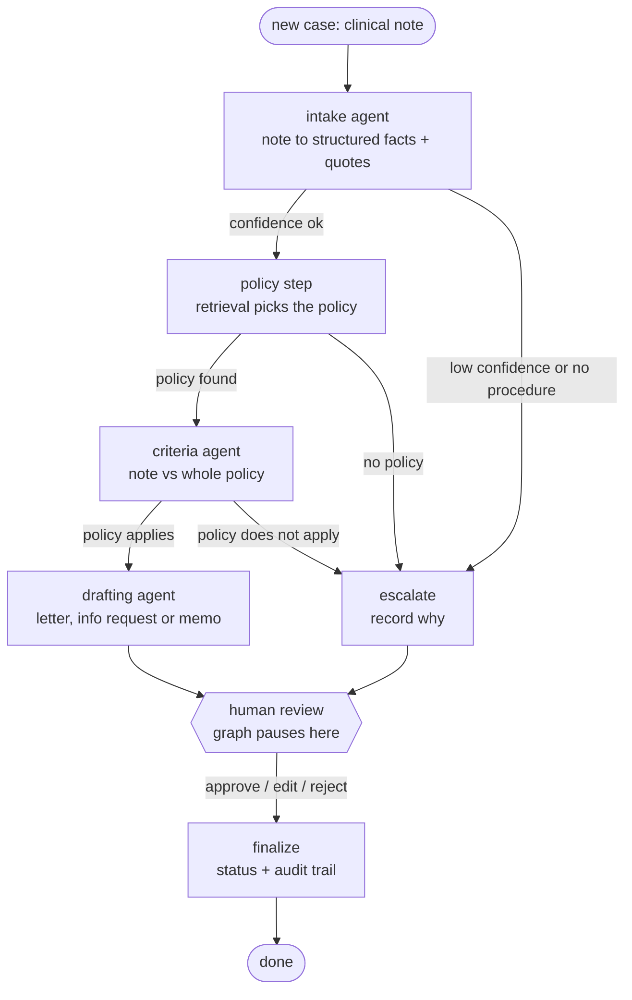

# Architecture (Week 3)

## Workflow

There is no edge from an agent to `finalize`. Every case, including escalations, stops at `human_review`,
which uses LangGraph's `interrupt()` and resumes only when a reviewer submits a decision.

## What is code and what is the model

| Step | Who decides | Why |
|---|---|---|
| Reading the note, matching it to criteria, writing drafts | Claude | Language understanding is what it is good at |
| Routing (escalate or continue) | Plain code | Safety-critical, so it must be deterministic, testable and explainable |
| Recommendation (`likely_meets`, `needs_more_info`, `likely_not_meets`) | `criteria.decide()`, plain code | The model reports findings; it never decides coverage |
| Approve, edit or reject | A human reviewer | Assistive system by design |

## Guardrails between the model and the decision

| Guardrail | Where | What it prevents |
|---|---|---|
| Every quote is checked against the note (whitespace-normalised) | intake, criteria | Fabricated evidence |
| A requirement marked `met` needs at least one verified quote, else it is downgraded to `unclear` | `criteria.validate` | Unsupported approvals |
| Citations must point to a policy section that was actually supplied | `criteria.validate` | Invented policy references |
| Drafting agent sees only verified structured facts, never the raw note | `drafter.draft` | Unverified text leaking into letters |
| Codes in a draft must exist in the source data | `drafter.check_codes` | Invented CPT or ICD codes |
| Low confidence, no policy, or a policy that does not cover the procedure skips the agents and goes to a human | `escalation_reason` | Confident nonsense on out-of-scope cases |
| Approve is refused when there is no draft; a finished case cannot be reviewed twice | `validate_review`, API 409 | Rubber-stamping and double submission |

## Why retrieval only picks the policy

The Week 2 eval showed section-level retrieval mixes up neighbouring sections inside the right policy. So the
policy step uses retrieval to choose which policy applies, then hands the **entire** policy (plus the general
requirements that a clinical note can satisfy) to the criteria agent. Section-level retrieval errors never
reach the decision.

## Persistence and audit

- Checkpointer: in-memory by default; `CHECKPOINTER=postgres` stores paused cases in Postgres so they survive
  an API restart.
- `cases` holds one row per case (status, recommendation, full state without policy text).
- `case_events` holds one row per workflow step with latency and token counts. This is what the Week 5
  dashboard reads.

## API

| Method and path | Purpose |
|---|---|
| `POST /cases` | Run the workflow until it pauses for review |
| `GET /cases/{id}` | Current status and review packet |
| `POST /cases/{id}/review` | Reviewer approves, edits or rejects (the only way to finalize) |
| `GET /cases` | Review queue from Postgres |
| `GET /policy/search` | Policy retrieval with citations |
