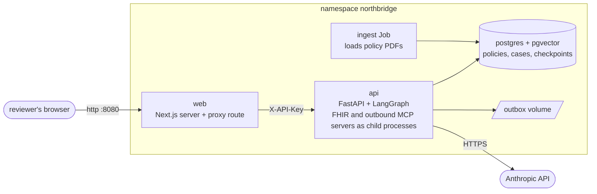

# Deployment (Week 6)

Two ways to run the whole system in containers: Docker Compose (database and API only, for quick checks) and
Kubernetes (everything, the way a real deployment would run). Both use the same images.

## What runs where



| Piece | Kind | Notes |
|---|---|---|
| `web` | Deployment, Service (LoadBalancer :8080) | The only thing exposed. Its server-side proxy adds the API key, so the browser never sees the backend address or the key. |
| `api` | Deployment (1 replica), Service | Holds the models in memory (about 1 GB). Reports ready only after they are loaded. |
| `postgres` | StatefulSet, PVC 2 Gi | pgvector image. Holds policy chunks, saved cases and their step trace, and the workflow checkpoints (`CHECKPOINTER=postgres`). |
| `outbox` | PVC 256 Mi | Where approved claims and messages are written. |
| `ingest` | Job, run on purpose | Loads the policy PDFs baked into the API image. Safe to repeat. |
| `northbridge-secrets` | Secret, created by the deploy script | Anthropic key from `.env`, random database password, random API key. Never in the repository. |
| `northbridge-config` | ConfigMap | Non-secret settings. A test checks every key is a real setting. |

## Prerequisites

- Docker Desktop with **Settings, Kubernetes, Enable Kubernetes** ticked (the default single-node cluster is fine).
- Docker Desktop resources of at least 6 GB memory (Settings, Resources). The API asks for 1 GB and may use up to 3.
- `kubectl` on PATH (Docker Desktop installs it) and `docker`.
- `.env` in the project root with a real `ANTHROPIC_API_KEY`.

## Deploy

```powershell
kubectl config use-context docker-desktop
.\scripts\k8s-deploy.ps1
```

The first run builds two images (the API image downloads CPU-only torch and two small models: 5 to 10 minutes; later
builds reuse cached layers), creates the secret, applies the manifests, loads the policies, and waits for every
pod. It refuses to run against any context other than `docker-desktop` unless you pass `-Context`. Then open
http://localhost:8080.

Useful variations: `-SkipBuild` to reuse images, `-SkipIngest` to leave the policy index alone.

```powershell
kubectl -n northbridge get pods                    # all Running, api 1/1 Ready
kubectl -n northbridge logs deploy/api             # "Warm-up finished; the API is ready"
kubectl -n northbridge port-forward svc/api 8000:8000   # then http://localhost:8000/docs (needs the API key header)
.\scripts\k8s-down.ps1 -Stop                       # scale to zero, keep the data
.\scripts\k8s-down.ps1                             # delete everything, data included
```

The API key for direct calls: `kubectl -n northbridge get secret northbridge-secrets -o jsonpath="{.data.API_KEY}"`
returns it base64 encoded.

## Why it is built this way

- **Models baked into the image.** A pod starts without reaching a model hub, and a restart never waits on a
  download. The embedder and reranker names in the Dockerfile are checked against the code by a test.
- **Ready means ready.** `/health` says the process is up (liveness). `/ready` says the database answers and the
  models are loaded (readiness), so Kubernetes sends no case to a pod that would spend a minute loading. This also
  removes the cold-start delay from the first reviewer's case.
- **Paused cases survive a restart.** `CHECKPOINTER=postgres` stores each paused case in the database; a reviewer
  can decide on a case after the API pod restarts.
- **Least privilege.** Every container runs as a non-root user, drops all Linux capabilities, disallows privilege
  escalation, and has a read-only root filesystem with an emptyDir for `/tmp`. Network policies deny all ingress and
  open only web to api, api to postgres, and anyone to web.
- **One API replica, on purpose.** A started case runs in a background thread of the pod that accepted it, and the
  outbox volume has a single writer. Running more replicas needs a work queue first; see the case study.
- **The `.dockerignore` keeps `.env`, virtual environments and `node_modules` out of the build context**, so a
  secret cannot be copied into an image by accident.

## What this is not

It is a demonstration of a deployable shape, not a production deployment. Before real use it would need: TLS and an
Ingress in front of `web`; a container registry and pinned image digests instead of `:local`; secrets from a
secret manager rather than `kubectl create secret` (Kubernetes secrets are only base64 in etcd unless encryption at
rest is on); managed or replicated Postgres with backups and a tested restore; a network plugin that enforces the
policies (Docker Desktop's default may not, so the policies are intended design until verified on a cluster that
does); authentication for reviewers instead of one shared API key; and the BAA, audit and retention work in the
discovery document. Everything here uses synthetic data only.

## Docker Compose

`docker compose up -d db` (Postgres only, for local development) or `docker compose up --build` (database and API,
with the outbox in `./outbox`). The Compose API is not warmed and has no web app; run the UI with `npm run dev`.

## CI

`.github/workflows/ci.yml` runs on every push: backend tests, frontend typecheck, tests and build, schema validation
of every Kubernetes manifest, and a build of both images (nothing is pushed).
